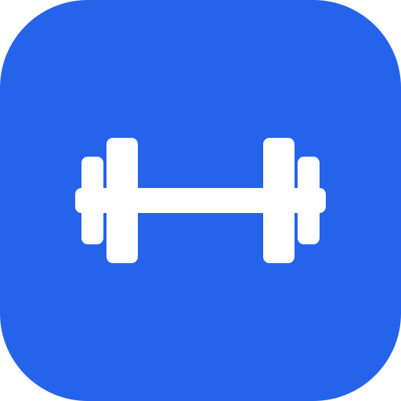
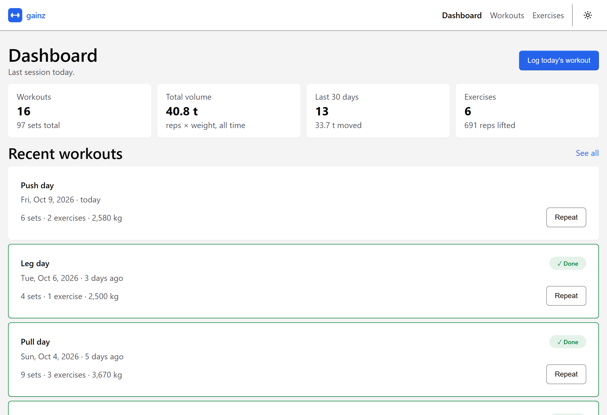
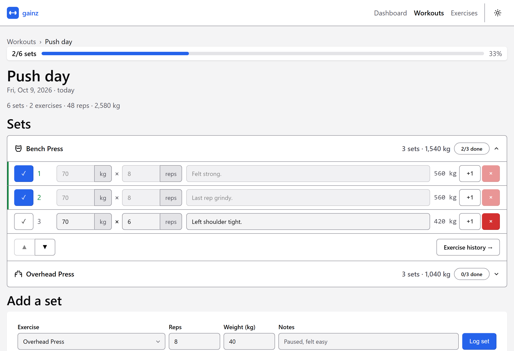
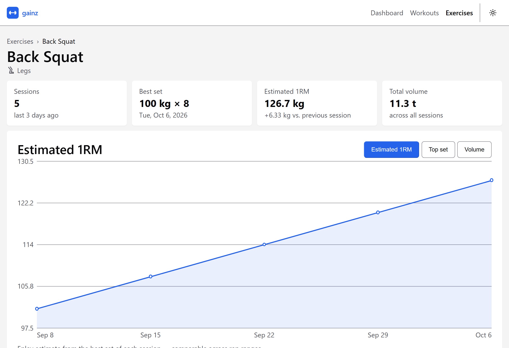
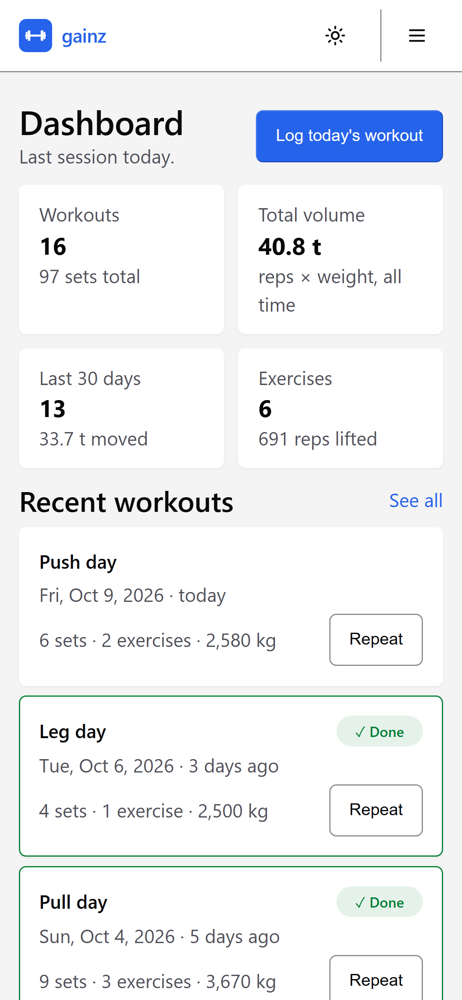
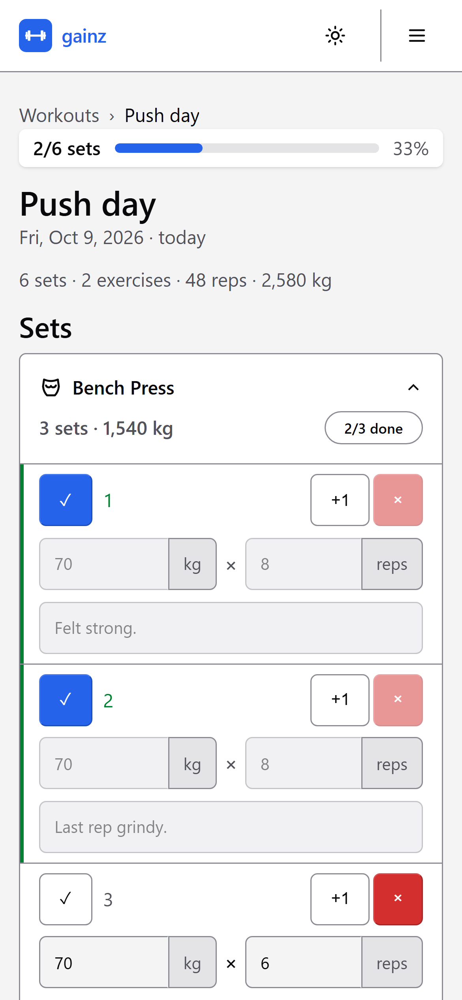
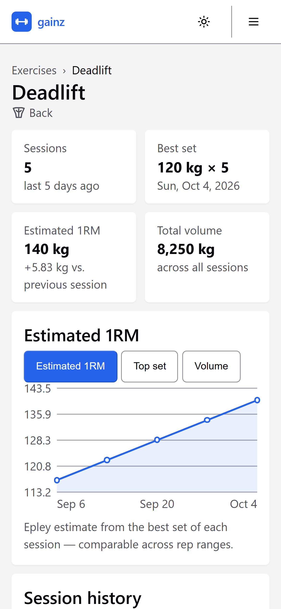

#  gainz

A small, self-hosted log for weight-lifting progress: workouts, the sets you did,
and the reps, weight and notes for each one. A [Bun](https://bun.sh) and SQLite
backend serves a frontend of TypeScript custom elements styled with
[Oat](https://oat.ink).

<picture>
  <source media="(prefers-color-scheme: dark)" srcset="docs/screenshots/dashboard-dark.png">
  
</picture>

## A look around

Tick off sets as you go, bump the reps with `+1`, and keep a note on the one
that felt heavy.

<picture>
  <source media="(prefers-color-scheme: dark)" srcset="docs/screenshots/workout-dark.png">
  
</picture>

Every exercise charts its estimated one-rep max, top set and volume over time.

<picture>
  <source media="(prefers-color-scheme: dark)" srcset="docs/screenshots/exercise-dark.png">
  
</picture>

Built for the phone in your hand between sets, with a light and a dark theme.

<table>
  <tr>
    <td width="33%">
      <picture>
        <source media="(prefers-color-scheme: dark)" srcset="docs/screenshots/mobile-dashboard-dark.png">
        
      </picture>
    </td>
    <td width="33%">
      <picture>
        <source media="(prefers-color-scheme: dark)" srcset="docs/screenshots/mobile-workout-dark.png">
        
      </picture>
    </td>
    <td width="33%">
      <picture>
        <source media="(prefers-color-scheme: dark)" srcset="docs/screenshots/mobile-exercise-dark.png">
        
      </picture>
    </td>
  </tr>
</table>

## Quick start

Requires [Bun](https://bun.sh) 1.4 or newer.

```sh
bun install          # Oat, plus TypeScript types for development
bun run seed         # optional: a few weeks of sample history
bun start            # http://localhost:3000
```

The database lives at `data/gainz.sqlite` (override with `GAINZ_DB`) and is
created and migrated on first run. It is git-ignored — the log is your data, not
source.

## Security

Without `GAINZ_PASSWORD_HASH` the server is open to anyone who can reach it —
fine on your own machine or inside a private network, never on the internet.
Create the hash with `bun run hash-password` to enable the login, and put HTTPS
in front of the server before exposing it.

## Documentation

- [`docs/deployment.md`](docs/deployment.md) — building a single file, running
  it on a server, and the automatic deploys from `main`.
- [`AGENTS.md`](AGENTS.md) — every script, including test, typecheck, lint and
  format, and an index of the rest of `docs/`.
